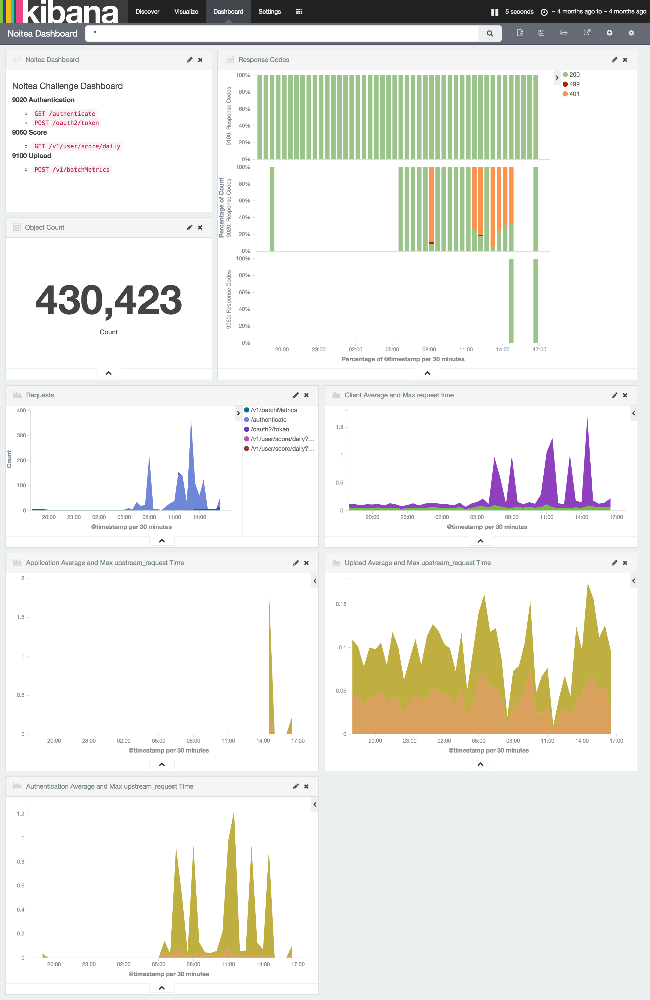
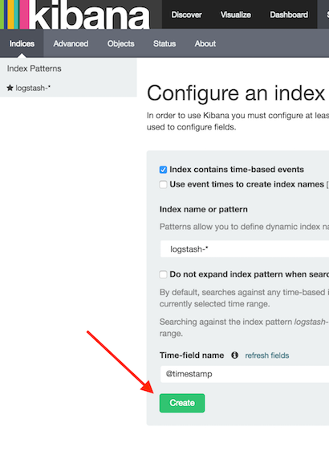
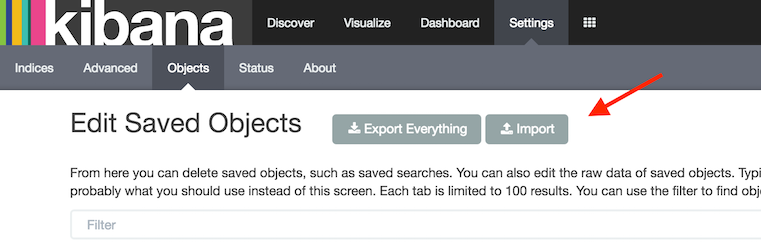

The Noitea code challenge is to parse log files stored in S3 doing some simple filtering and computing
summary statistics. I choose to use the [ELK](https://www.elastic.co/webinars/introduction-elk-stack) stack to accomplish this.

The log-files all exist in the "root" path of the s3 bucket. They are gzip compressed nginx access
logs generated with the following `log_format` directive:

    log_format proxy_combined
        '$remote_addr - $remote_user [$time_local] '
        '"$request" $status $body_bytes_sent '
        '"$http_referer" "$http_user_agent" $request_time $pipe '
        'upstream: $upstream_addr '
        '$upstream_status $upstream_response_time';

Each visualization includes a search to filter out all health check log entries:  
`-(method: "GET" AND request: "/ok" AND httpversion: "1.1" AND http_user_agent: "Ruby") -(status: "400")`

When Logstash finishes ingesting the logs the dashboard should look like this



## Dependencies
* docker, docker-machine, and docker-compose
* a default docker-machine

## Setup

```
# export AWS keys for access to bucket (provided in email)
export AWS_ACCESS_KEY_ID=##########
export AWS_SECRET_ACCESS_KEY=##########

# start dashboard
docker-compose up -d

# check logstash logs
docker logs -f aetionchallenge_logstash_1

# connect to kibana
open http://$(docker-machine ip):5601/
```

Once kibana has loaded, configure an index  


import dashboard and visualizations  


Total Object Count is **430,423**

## Improvements
1. Utilize [Timelion](https://www.elastic.co/blog/timelion-timeline) (included in this setup) to do anomaly detection.
1. Move ElasticSearch database to data-only container.
